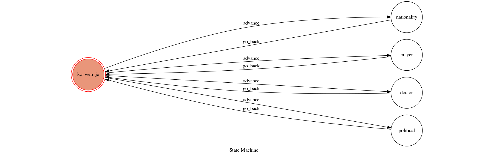
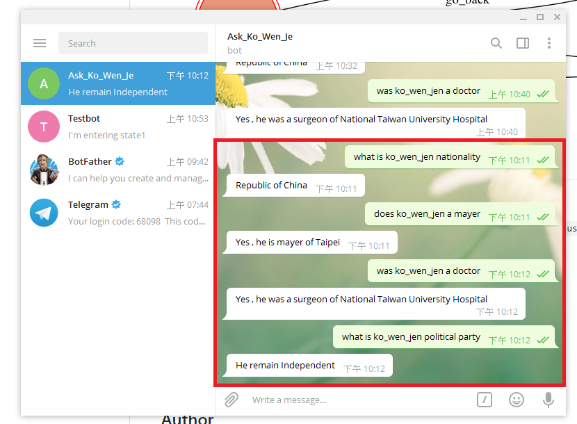

# TOCproject_F74032170
Code for TOC Project

## Setup
* Python3

### Install Dependency
```sh
pip3 install -r requirements.txt
```
### Secret Data

`API_TOKEN` and `WEBHOOK_URL` in app.py **MUST** be set to proper values.
Otherwise, you might not be able to run your code.

###API_TOKEN for this bot
the bot name in telegram is "Ask_Ko_Wen_Je"
the bot username in telegram is "Ask_Ko_Wen_Je_bot"
You will find it at "t.me/Ask_Ko_Wen_Je_bot" in telegram. 
Use this token to access the HTTP API:
483259801:AAE94xLUWG_kG41zZkXDBLHcQyfTXoOOjjA

### Run Locally
You can either setup https server or using `ngrok` as a proxy.

**`ngrok` would be used in the following instruction**

```sh
ngrok http 5000
```

After that, `ngrok` would generate a https URL.

You should set `WEBHOOK_URL` (in app.py) to `your-https-URL/hook`.

#### Run the sever

```sh
python3 app1.py
```
## Finite State Machine


## Usage
The initial state is ser to "ko_wen_je"
The function of bot is to know about "ko_wen_je" 
You can ask question about "Ko_Wen_Je"

* user
	* Input: "what is ko_wen_jen nationality"
		* Reply: "Republic of China"

	* Input: "does ko_wen_jen a mayer"
		* Reply: "Yes , he is mayer of Taipei"
		
	* Input: "was ko_wen_jen a doctor"
		* Reply: "Yes , he was a surgeon of National Taiwan University Hospital"

	* Input: "what is ko_wen_jen political party"
		* Reply: "He remain Independent"
		
## Deno ScreenShot

